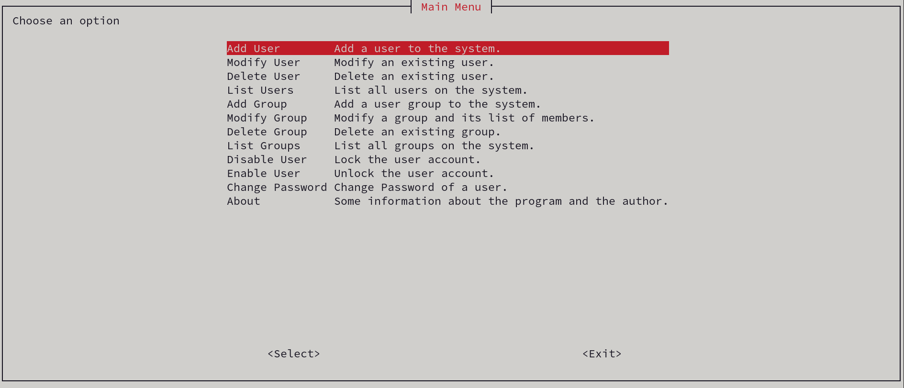
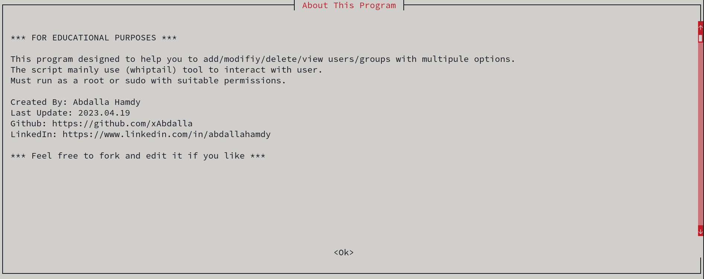

# System Admin Helper Project
This bash script performs some administration tasks to help system admins using GUI `whiptail` menus.

## Features
Could perform main tasks like:
* Add User
    > Available Options:
    > * Comment
    > * No Create Home
    > * Home (specific home directory)
    > * Skeleton
    > * Expire Date
    > * Inactive
    > * GID (Primary Group)
    > * Groups
    > * UID
    > * Password (Plain-Text)
    > * Shell
* Modify User
    > Available Options:
    > * Comment
    > * New Home
    > * Expire Date
    > * Inactive
    > * GID (Primary Group)
    > * Groups
    > * Login Username
    > * Lock the Account
    > * Unlock the Account
    > * Move Home
    > * UID
    > * Password (Plain-Text)
    > * Shell
* Delete User
    > Available Options:
    > * Remove Home
    > * Force Delete
    > * SELinux
* List Users
* Add Group
    > Available Options:
    > * GID
    > * Group Users
* Modify Group
    > Available Options:
    > * GID
    > * New Group Name
    > * Group Users
* Delete Group
* List Groups

### Some Quick Modifications
* Disable User Account
* Enable User Account
* Change User Password

## Usage
### Privileges
As most of the commands in this program require root privileges, the script checks if the program runs as root and asks the user to run as root or `sudo` if not.

### Important Packages
The program uses GUI menus to get the commands and inputs from the user. These menus are based on the `whiptail` tool which is provided by `newt` package. There is another tool that we used to get the terminal dimensions called `resize` provided by `xterm-resize` package.
These packages are important to the program so at start the program checks if these packages are installed and if not, it will install them.

### Main Menu
The main menu displays the general commands to choose from.

### Add User Option
"Add User" will ask the user to enter the new username and check if it is valid to use, then it will display some options that the user can use with the `useradd` command.

Every option has its method to make sure its input is valid.

### Modify User Option
"Modify User" will ask the user to enter username and check if it exists, then it will display some options that the user can modify with the `usermod` command.

Like "Add User" every option has its method to check if its input is valid to use.

### Delete User Option
"Delete User" will ask the user to enter username and check if it exists, then it will display some options that the user can modify with the `userdel` command.

### List Users Option
A simple script to read some users information from `/etc/passwd` file and display it as follows.

### Add Group Option
"Add Group" will ask the user to enter the new group name and check if it is valid to use, then it will display some options that the user can use with the `groupadd` command.

Like others, every option has its method to check if its input is valid to use.

### Modify Group Option
"Modify Group" will ask the user to enter a group name and check if it exists, then it will display some options that the user can modify with the `groupmod` command.

As group modifications works differently than user modification as it require every modification to run separately, the output message is different than the rest of the operations.

### Delete Group Option
"Delete Group" will ask the user to enter a group name and check if it exists, then it will display some confirmations to delete the group.

### List Groups Option
A simple script to read some groups information from `/etc/group` file and display it as follows.

### Disable User Option
"Disable User" will ask the user to enter username and check if it exists, then it will display confirmation to disable the user.

It will lock the account and the password.

### Enable User Option
"Enable User" will ask the user to enter username and check if it exists, then it will display confirmation to enable the user.

It will unlock the account and the password (if available).

### Change User Password Option
"Change Password" will ask the user to enter username and check if it exists, then it will display two password input dialog and check if the two inputs are a match.

### About Option
It shows some information about the program and the creator.

### 
After every operation it will provide the user with a feedback on whether the operation has been executed successfully or not, then return to the main menu.

## Contributing
Feel free to contribute. Don't hesitate to refactor current code base. This project is mainly build for educational and demonstration purposes, so verbose documentation is welcome.
